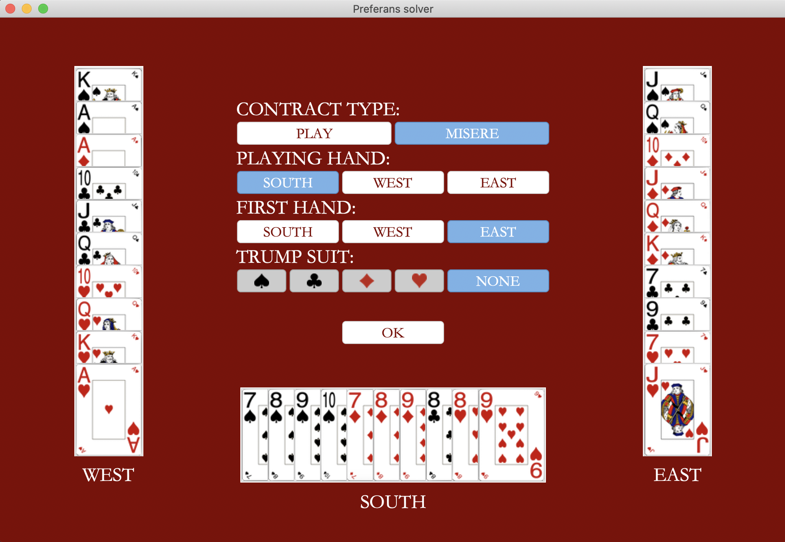
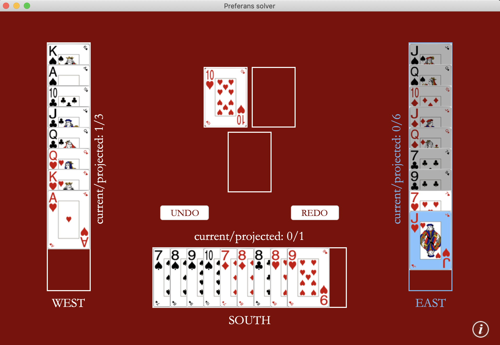

# Preferans (преферанс) solver.

## Quick setup
To clone this repo to your local machine, type this command from your preferred directory:
```
git clone https://github.com/avysogorets/preferans-solver.git
```
Then, follow these steps in your terminal window to set up virtual environment:
#### MacOS & Linux
```
python3 -m pip install --user --upgrade pip # install pip
python3 -m pip install --user virtualenv # install environment manager
python3 -m venv env # create a new environment
python3 -m pip install -r requirements.txt # install packages
source env/bin/activate # activate the environment
```
#### Windows
```
py -m pip install --upgrade pip 
py -m pip install --user virtualenv
py -m venv env
py -m pip install -r requirements.txt
.\env\Scripts\activate
```
To run the graphical application, input these commands; the application window should open:
```
cd solver-gui
python3 frontend.py
```

## Introduction
Preferans is a Russian card game that gained its popularity in the early 19-th century. It is played with a French 32-card deck (7 to Ace) dealt for three hands of 10 cards each and a 2-card talon. In a nutshell, Preferans is a trick-taking game with the goal of fulfilling a declared contract, agreed upon by all players during the bidding stage. At this stage, players can bid to either (1) pass (2) play a game, or (3) play misere, leading to one of three types of contracts: (1) all-passes, (2) play, or (3) misere. All-passes occurs when all players pass and requires them to avoid taikng tricks, adding negative points for each trick taken. Consider other contracts in more detail:
- *Play* is a contract where one "outstanding" player takes responsibility to take a declared number of tricks (no less than 6) under a major suit of his choice. The other players have an option to *whist*&mdash;contract themselves to take some or all of the remaining tricks. When exactly one player whists, he may choose to open up his and other player's cards (but not the *outstanding player's cards*), which is called "playing in the light". Ultimately, the outstanding player and his opponents as a whole are incentivized to take as many tricks as possible.
- *Misere* is a contract where one "outstanding" player obliges himself to take no tricks at all. The other two players open up their cards and try to force the other player to take as many tricks as possible. Note that misere is always played without a designated major suit. Misere is a rare and risky contract with a lot at stake and hence is not played too often.

The complete set of rules of Preferans is sophisticated and has a great deal of nuances; you can read more [here](https://en.wikipedia.org/wiki/Preferans).

## This program

This program computes the outcome of any given deal (the number of tricks taken by each player) assuming that *complete information* is available to all players (i.e., all cards open) and that they use it to *play optimally*. The optimal play is defined recursively: (1) it is optimal for a player with one card left to play it, and (2) it is optimal to play the card that leads to the most desirable outcome (i.e., most desirable final projected objective of the *playing hand* with respect to the contract type) assuming *optimal play* from the opponents (clearly, if one's opponents play non-optimally, the projected final objective of the playing hand can only improve from his/her perspective). For example, whisting hands wish to minimize (maximize) the final number of tricks taken by the playing hand under play (misere) regardless of the distribution of other tricks between their hands.

## Implementation

The backend algorithm uses depth-first-search with memoization to efficiently process the graph of all game evolution possibilities (game states or *subgames*). Clearly, the number of nodes in this graph differs from deal to deal, however, on average, it is in order of tens of millions. This is reduced by roughly a factor of 10 by saving recursive calls on consecutive cards; e.g., it is unnecessary to consider both A&diams; and K&diams;&mdash; for a single move---the outcomes will be identical. In general, the algorithm takes anywhere from a few seconds to a few minutes to finish. The GUI is written using ```tkinter```.

## Example: Kovalevskaya's misere

For a quick demonstration, consider a well-known example&mdash;Kovalevskaya's misere. South is playing misere; East is to start (turns alternate clockwise). Can West and East force South to take one or more tricks? If so, how many under optimal play by all? The solution (in Russian) can be found [here](https://zen.yandex.ru/media/id/5b9e12e5b76d9000aa070845/reshenie-zadachi-s-mizerom-kovalevskoi-60cf77a8bb96047128248c10).

<p align="center">
                 
  
</p>

The number of projected tricks conceded by South is 1 as can be seen on the right screenshot.

## Limitations

While the solver tracks down all optimal moves, it can be difficult to undersatnd the logic behind them. In Kovalevskaya's misere, it is optimal for South to play spades in rounds 5,6 and 7, which may seem unreasonable at first, especially before we know that it is possible to force South to take at least one trick. Hence, the solver provides only limited explanation for its projections. Further, the solver cannot apply to all real games because it requires knowing all cards in all hands.
